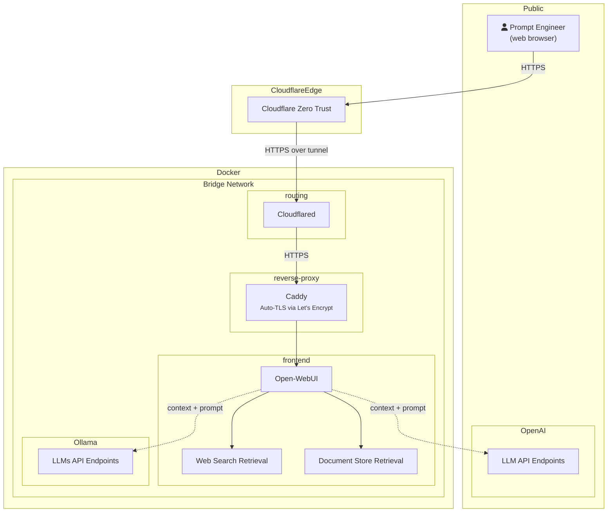

# Self-hosted Open-WebUI with Ollama on GitHub Codespace
Running Ollama with a model on Docker Desktop locally is a bad idea.

## Technology stack
1. Ollama is a framework for building and running LLM locally.
2. Open-WebUI as a web-based LLM interface
3. Caddy as a reverse proxy
4. CloudFlare Tunnels allows public access with HTTPS.
5. Bring-Your-Own-Model API key, such as OpenAI, OpenRouter, GitHub Models, etc.
6. Tavily search for enabling Web Search to LLM
7. Docker Compose to wrap everything a YAML file
8. DevContainer lets us use a Docker container as a full-featured development environment.
9. GitHub Codespace as a container runtime

## Conceptual Diagram

## Required Environment Variables for Cloudflare service
`TUNNEL_TOKEN` and `PUBLIC_HOSTNAME` must be set as Codespace secret variables or creating `.env` file in the root directory.