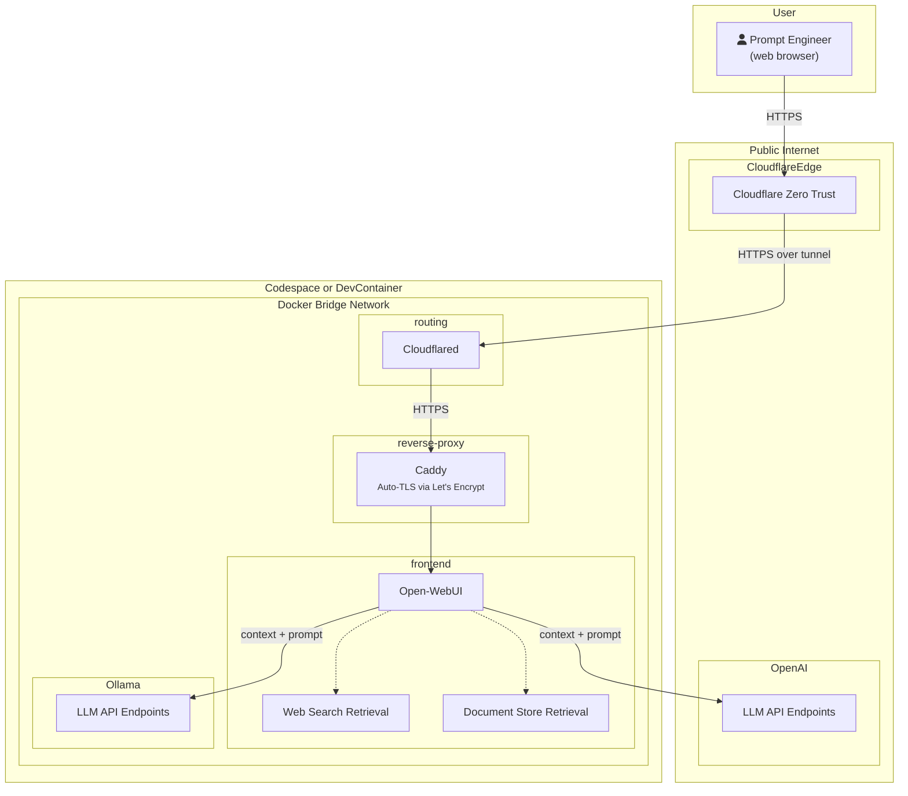

# Self-hosted Open-WebUI with Ollama on GitHub Codespace
## Conceptual Diagram

## Background Problems and Technology Stack
1. Ollama is a framework for building and running LLM locally.
2. However running Ollama locally with a model on Docker Desktop is not practical.
3. Therefore, the solution is : `Bring-Your-Own-Model` with API key, such as OpenAI, OpenRouter, GitHub Models, etc.
4. Open-WebUI as a web-based LLM user interface. It has a built-in ChromaDB as default vector database.
5. Caddy as a reverse proxy. It is simple configuration but its default HTTPS makes backend services secure. 
6. CloudFlare Zero Trust allows public access to backend services over tunnel securely.
7. Tavily search for enabling Web Search to LLM
8. Docker Compose to wrap everything up as a portable YAML file
9. DevContainer lets us use a Docker container as a full-featured development environment.
10. GitHub Codespace as a container runtime for demo purpose

## Required Environment Variables for Cloudflare service
`TUNNEL_TOKEN` and `PUBLIC_HOSTNAME` must be set as Codespace secret variables or creating `.env` file in the root directory.